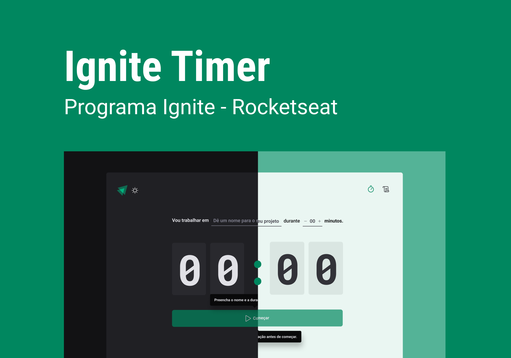

<h1 align="center">Time Pomodoro</h1>

<p align="center">
  <a href="#-tecnologias">Tecnologias</a>&nbsp;&nbsp;&nbsp;|&nbsp;&nbsp;&nbsp;
  <a href="#-projeto">Projeto</a>&nbsp;&nbsp;&nbsp;|&nbsp;&nbsp;&nbsp;
  <a href="#-layout">Layout</a>&nbsp;&nbsp;&nbsp;|&nbsp;&nbsp;&nbsp;
    <a href="#-clonando-o-projeto-para-sua-máquina">Clonar</a>&nbsp;&nbsp;&nbsp;
</p>

<br>

<p align="center">
  
</p>

## 🚀 Tecnologias

Esse projeto foi desenvolvido com as seguintes tecnologias:

- [React](https://pt-br.reactjs.org/)
- [TypeScript](https://www.typescriptlang.org/)
- [Node e NPM](https://nodejs.org/)
- [Styled-Components](https://styled-components.com/)
- [Datefns](https://date-fns.org/)
- [Immer](https://immerjs.github.io/immer/)
- [React-hook-form](https://react-hook-form.com/)
- [Zod](https://www.npmjs.com/package/zod)
- [React-Router-Dom](https://reactrouter.com/en/main/start/overview)

## 🔖 Layout

Você pode visualizar o layout do projeto através [DESSE LINK](https://www.figma.com/file/eDfmgQz2WNLSOxoDtkI7P7/Ignite-Timer-(Community)-(Copy)?node-id=11%3A599&t=zw4eOlbkA1Vpo8JC-0). É necessário ter conta no [Figma](https://figma.com) para acessá-lo.

#

# 💻 Clonando o projeto para sua máquina

1. Abra o terminal de seu computador.
2. Acessar a pasta de seus projetos.
3. Estando dentro da pasta de seus projetos, execute os comandos abaixo para clonar o projeto online:

```bash
# Para fazer o download do projeto para seu computador
$ git clone git@github.com:marlisonmourao/timer-pomodoro.git
# Entrar na pasta do projeto 
$ cd Timer Pomodoro

# Para baixar as dependências do projeto
$ npm install ou npm i

# Abra com o editor vscode
$ code .
```

4. Pronto, agora basta testar e fazer as alterações que desejar.
  
<br>
<br>

<p align="center"></p>
<br>
<br>

---
<p align="center"> Made with 💜 by <a href="https://github.com/marlisonmourao"> Marlison Mourão </a></p>
